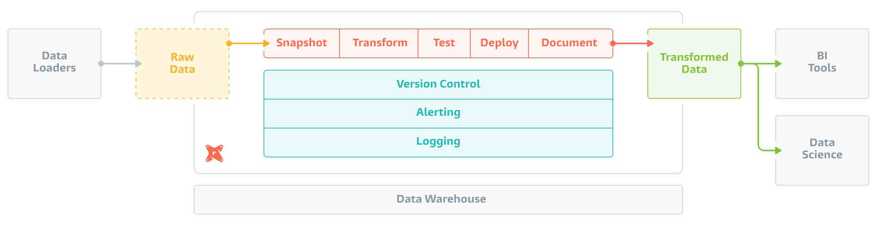
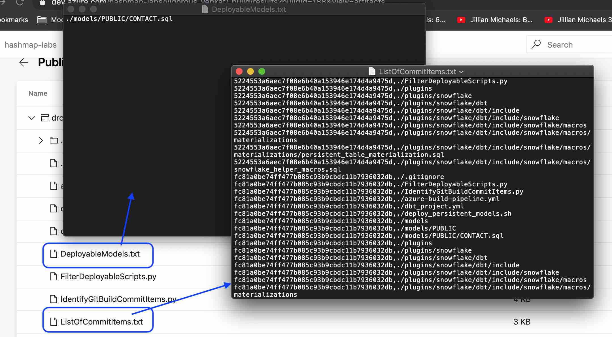
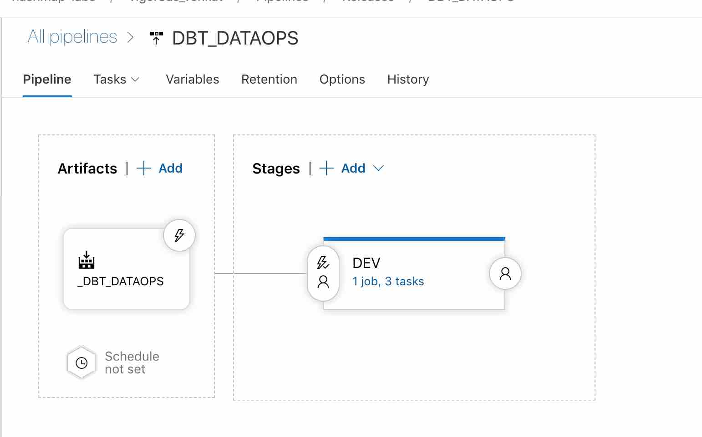
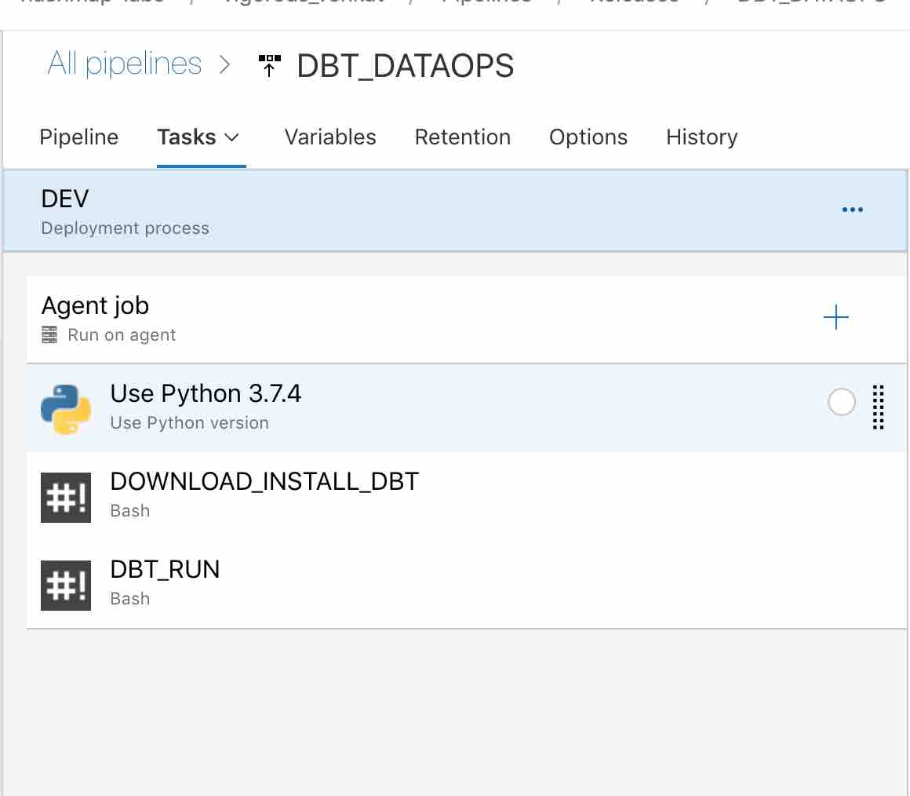
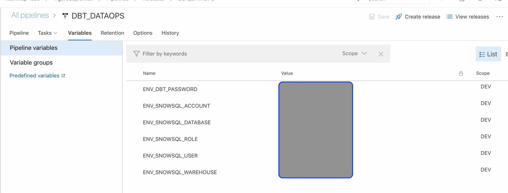
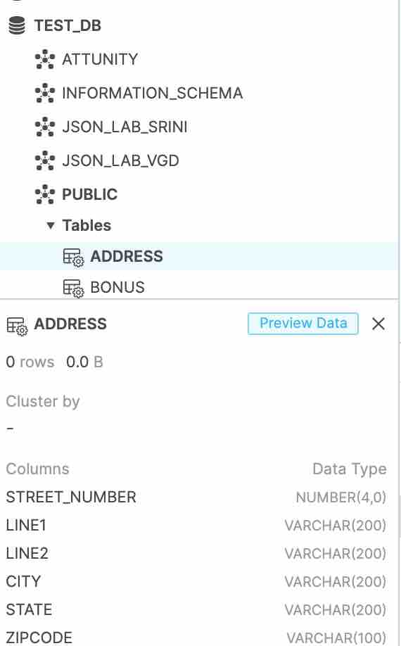

# DBT AS A TOOL FOR DATABASE DEVOPS
 
# OVERVIEW

Being in a customer engagement; we were asked to figure out how to do 
Database DEVOPS for Snowflake. DEVOPS for Database has been a complex 
procedure that the industry is still in the process of perfecting it. 
While there are some tools in the market:
- [Squitch](sqitch.org)
- [Red-Gate](https://www.red-gate.com/)
- [LiquiBase](http://www.liquibase.org)
- [Flyway](https://flywaydb.org/)

Other than 'Squitch' the others do not support [Snowflake](https://www.snowflake.com/)
yet. 

[DBT](https://www.getdbt.com/) being a data transformation tool and Jinja 
template based tool, I wanted to see if it could be a potential answer to
solve this issue of database devops. With the ability to develop custom 
materialization, I was able to create the 'persistent_table' materialization
which provided an answer for creating 'source tables' in DBT. You can read
about this enhancement here [Persistent_tables_Materialization](./Persistent_Tables_Materialization.md).

Having done that I took the steps to develop a simple CI/CD process to
deploy database scripts using Azure Devops. In this walk thru i go step-by-step
on how to setup DBT to deploy the scripts. The code is available in my 
git repo [venkatra/dbt_hacks](https://github.com/venkatra/dbt_hacks).
 
## Tools/Services Used
For this blog the following tools were used: 
 
### DBT

[DBT](https://www.getdbt.com/product/) is a command line tool based of SQL primarily
used by Analyst to do data-transformation. In other words it does the
'T' in ELT.

It facilitates in writing modular SELECT SQLs and takes care of dependency
,compilation ,materialization in run time.



### Azure Devops
[Azure Devops](https://azure.microsoft.com/en-ca/services/devops/) provides 
developer services to support teams to plan work, collaborate on code development, 
and build and deploy applications.

### Snowflake
[Snowflake](https://www.snowflake.com/) is a fully relational ANSI SQL 
CLOUD data warehouse,so you can leverage the skills and tools your organization 
already uses. Updates, deletes, analytical functions, transactions, 
stored procedures, materialized views and complex joins give you the full 
capabilities you need to make the most of your data.

## Continous Integration
Continous Integration (CI) process is acheived by [Azure Pipelines](https://docs.microsoft.com/en-us/azure/devops/pipelines/get-started/what-is-azure-pipelines?view=azure-devops).
This pipeline is typically invoked after the code has been committed. The
pipeline tasks typically handles 
 - Code compilation
 - Unit Testing
 - Packaging
 - Distributing to a repository (ex: Maven)
 
In the case of database scripts file; there isnt much of a validation 
that can be done, other than 
 - code formatted check
 - scripts follow certain inhouse practices (ex: NAMING convention)
 - script compilation (this is possibe in SQL-server via DACPAC/BACPAC).
 
Snowflake currently does not have any tool that can validate the script 
before execution. It can validate only during deployment.

Hence in the build phase I typically do only
 - Code format check
 - Naming convention check
 - Packaging
 - Distributing to a repository (ex: Maven)
 
### Identifying the commit changes 
Given the set of all scripts; we have to figure out which scripts were 
added or updated. If you cannot identify these scripts you will end up
re-creating the entire database/schema etc.. which is not what you want.

To solve this issue; we can use the [Azure Devops API](https://github.com/Microsoft/azure-devops-python-api).
Going through the doc you will different rest end points and determine detailed
information on what got commited, when , by whom etc.. 

The python script [IdentifyGitBuildCommitItems.py](./IdentifyGitBuildCommitItems.py) 
has been developed in response to this. Its sole purpose is to get the 
 list of commits that is part of the current build and thier artifacts 
 (the files that were added/changed). Once identified it will write them 
 into a file 'ListOfCommitItems.txt'; during execution. 
 
You can see the result of this in the below sections.

### Identifying the deployable scripts
During the course of development; the developer could have not only created
scripts for table creation. he/she could have developed transformation models,
markdown documentations, shell scripts etc. The 'ListOfCommitItems.txt' that
was created earlier would contain all these; If a file was committed multiple
times the script also does not de-dup the commits.

To keep things in a modular, the script [FilterDeployableScripts.py](./FilterDeployableScripts.py)
was created. Its responsibility are:
 - Parse the 'ListOfCommitItems.txt'
 - Identify the sql scripts from various commits
 - Filter out only those scripts which are to be materialized as 'persistent_tables'
 - write the result to the file 'DeployableModels.txt'
 
### Pipeline
The build pipeline is thus a serious of steps/tasks
- Install Python3.6 (needed for azure devops api)
- Install azure-devops python library
- Execute python script : IdentifyGitBuildCommitItems.py
- Execute python script : FilterDeployableScripts.py
- Copy the files into Staging directory
- Publish the artifacts (in staging directory) 

These are captured in [azure-build-pipeline.yml](./azure-build-pipeline.yml).

#### Published Artifacts
The following screenshot highlights the list of artifacts that gets published
by the build. It also gives a sample output of 'ListOfCommitItems.txt'
; this was captured in the initial run.



Another thing to notice is that 'DeployableModels.txt' file contains only
the CONTACT table definition file; thus ignoring all other files that are 
not meant to be run.

Below is a screenshot from a different build run, during this run 
 - The script file 'deploy_persistent_models.sh' was updated
 - The table definition for 'ADDRESS' was added.
You could see that the script identified only these changes and captures
them in the 'ListOfCommitItems.txt'. Thus safely ignoring all the other
files.


Again the 'DeployableModels.txt' file contains only
the ADDRESS table definition file; thus ignoring all other files that are 
not meant to be run.

## Continous Deployment
Continous Deployment (CD) process is acheived by Azure Release Pipelines.
This pipeline is geared towards the actual deployment to specific snowflake
environment (for ex: development). 



The "Stage" section is usually specific to the environment onto which the
deployment needs to happen. It consists of the following tasks



| Task | Description |
| ----------- | ----------- |
| Use Python 3.7.4  | Needed for DBT |
| DOWNLOAD_INSTALL_DBT  | Install DBT; this is needed as it is not part of Azure VM |
| DBT_RUN | Executes the deployment script [deploy_persistent_models.sh](./deploy_persistent_models.sh) |

#### Task: DOWNLOAD_INSTALL_DBT 
This is a Bash task which has the below inline code:

```bash
#Install the latest pip
sudo pip install -U pip

# Then upgrade cffi
sudo apt-get remove python-cffi
sudo pip install --upgrade cffi
sudo apt-get install git libpq-dev python-dev

# Specify the version on install
sudo pip install cryptography==1.7.2

sudo pip install dbt

dbt --help
```

#### Task: DBT_RUN 
This is a Bash task which has the below inline code:

```bash
export SNOWSQL_ACCOUNT=$(ENV_SNOWSQL_ACCOUNT)
export SNOWSQL_USER=$(ENV_SNOWSQL_USER)
export DBT_PASSWORD=$(ENV_DBT_PASSWORD)
export SNOWSQL_ROLE=$(ENV_SNOWSQL_ROLE)
export SNOWSQL_DATABASE=$(ENV_SNOWSQL_DATABASE)
export SNOWSQL_WAREHOUSE=$(ENV_SNOWSQL_WAREHOUSE)
export DBT_PROFILES_DIR=./

chmod 750 ./deploy_persistent_models.sh

./deploy_persistent_models.sh
```
This sets up the various env configuration that will be used by DBT and
used as part of the execution.

The 'ENV_' are variables that will be substituted at run time. They need
to be defined in the variable section as below:



##### Log 
Upon release, the table will be created in snowflake. Here is a screenshot 
of the successful run and the logs of DBT_RUN task:


and now you can see the artifact in snowflake:




### Limitation
The below are some limitations:
- Deployment of objects in a specifi order is yet to be developed.
- Enhancement for Views, Functions etc. is yet to be developed.
- Not all scenarios is covered; you would need to work out on those.

## Whats next
The above set of steps showed that DBT can be used a potential tool for 
DATABASE DEVOPS. However cautionarily adoption of this method is yet to
be determined.