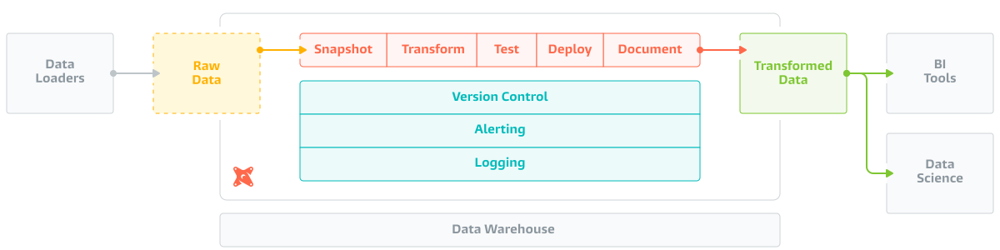
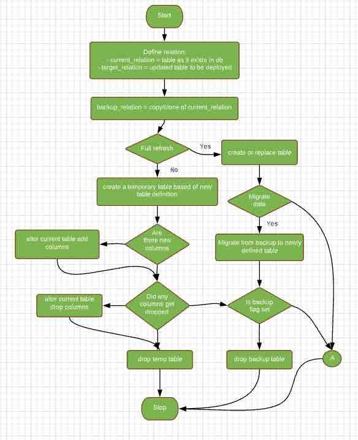
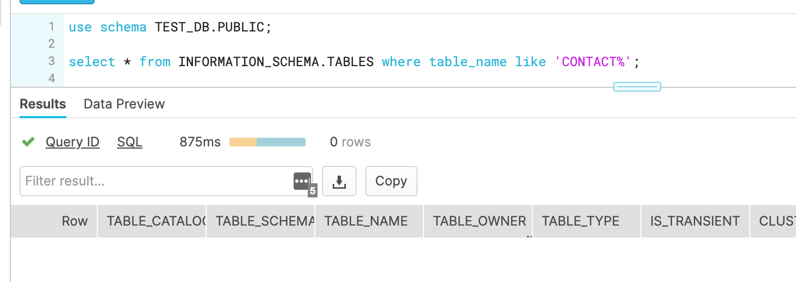
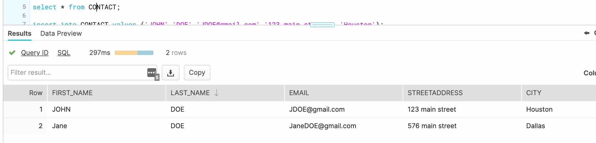
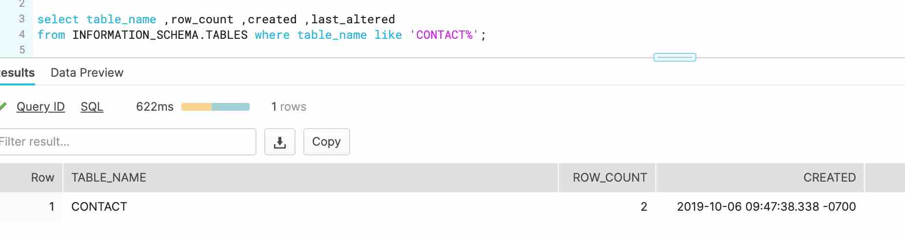
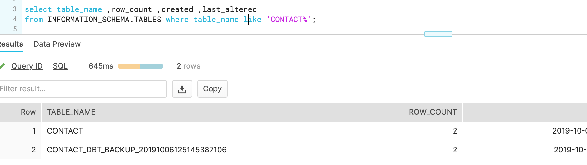
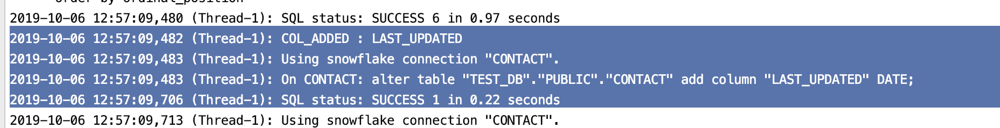
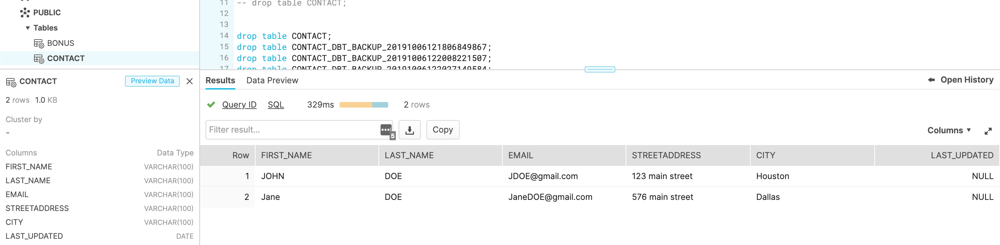
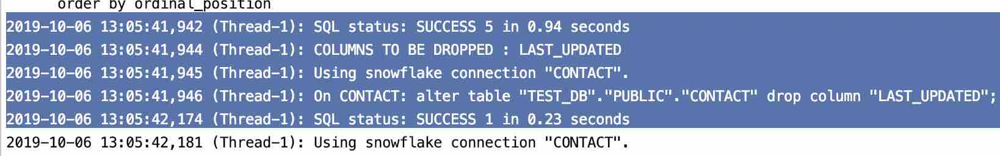
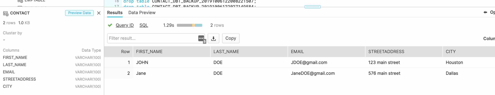

# Persistent Tables materialization for creating tables in DBT

## DBT

[DBT](https://www.getdbt.com/product/) is a command line tool based of SQL primarily
used by Analyst to do data-transformation. In other words it does the
'T' in ELT.

It facilitates in writing modular SELECT SQLs and takes care of dependency
,compilation ,materialization in run time.

### Reference
If you are interested in learning more about DBT here are some links
- Read the [dbt viewpoint](https://dbt.readme.io/docs/viewpoint)
- [What is dbt](https://dbt.readme.io/docs/overview)

### Source table 
In DBT, a "Source Table" holds data upon which data transformations are done.
The transformation are SELECT SQL statements which are joined together and
then materialized into tables.

When developing scripts or models with DBT the main statements is SELECT 
SQL dialect. There are no create or replace statements written in Model statements.
This means that DBT does not offer methods for issuing CREATE TABLE statements 
which can be used for source table. Hence it is upto the user to define 
these outside of DBT.  

### Macros
But if you closely look at how DBT offers customization or enhancement to
be developed using [Macros](https://docs.getdbt.com/docs/macros); you will
realize that these are pretty much Jinja templates. And if you search around
the [code base in github](https://github.com/fishtown-analytics/dbt), you
would come across common macros like
- create_view_as
- get_columns_in_relation
- drop_relation_if_exists
- alter_column_type
- truncate_relation
- ...
 
### Materialization
[Materializations](https://docs.getdbt.com/docs/materializations) are strategies 
for persisting dbt models in a warehouse. There are four types of materializations 
built into dbt. They are:
- table
- view
- incremental
- ephemeral

DBT also offers facility to develop [Custom Materialization](https://docs.getdbt.com/docs/creating-new-materializations)
too. This led me to investigate if we can use these functionalities to develop
a custom materialization with the following functionalities
- Able to process a model file which contains a "CREATE TABLE" statement.
- Identify if a column has been added/updated/dropped in the definition 
and issue an alter statement accordingly.
- Do a complete full refresh of the data.
- Backup the table before doing any modifications.
- Migrate the data after the table has been modified.

It’s possible to achieve this and I start by explaining as below. Also
I am using snowflake as the choice of database, you might need to change 
it accordingly.

#### Defined Macros
I have defined the following macros in [snowflake_helper_macros](./plugins/snowflake/dbt/include/snowflake/macros/snowflake_helper_macros.sql)

| Macro name | Description |
| ----------- | ----------- |
| clone_table_relation_if_exists  | Used to clone a relation |
| copyof_table_relation_if_exists | Used for copy data from one relation to another |
| create_table_stmt_fromfile | copies the create table from the model file |

#### Persistent Table Materialization
I have defined the custom materialization [persistent_table_materialization](./plugins/snowflake/dbt/include/snowflake/macros/materializations/persistent_table_materialization.sql)
to handle the above defined needs. In short the implementation has the 
following logic:

#### Model
Below is an example of the model file which now could be materialized by
DBT. The example is here [CONTACT](./models/PUBLIC/CONTACT.sql)

`
    {{ config(materialized='persistent_table'
        ,retain_previous_version_flg=false
        ,migrate_data_over_flg=true
    )}}
    
    CREATE OR REPLACE TABLE "{{ database }}"."{{ schema }}"."CONTACT" (
        FIRST_NAME VARCHAR(100),
        LAST_NAME VARCHAR(100),
        EMAIL VARCHAR(100),
        STREETADDRESS VARCHAR(100),
        CITY VARCHAR(100)
    );
    
`

| - | Description |
| ----------- | ----------- |
| ` materialized='persistent_table' `  | Indicates to use the persistent table materialization |
| `retain_previous_version_flg` | Flag to indicate if a copy of the existing table should be kept as a backup. Each run will have a backup table with suffix _DBT_BACKUP_YYYYMMDDHHMMSS |
| `migrate_data_over_flg` | In case of a full refresh, this flag indicates if the data should be migrated over. |
| `"{{ database }}"."{{ schema }}"` | Placeholder for database name and schema name |

#### Example
To see this materialization in action; here is a walkthrough with screenshots
on the various facilities.

###### - full-refresh
We start of with no table defined in the database. A "full-refresh" flag
would mean to create the table as if nothing existed. Should the table did
exist it will recreate the table (due to 'CREATE OR REPLACE' in the model).

`
  dbt -d run -m CONTACT --full-refresh  
`

The table got created and I have inserted some dummy records manually. 
Here is the screenshot:

###### full-refresh with migration data enabled

Lets do a full-refresh with the 'migrate_data_over_flg' set to true

`
    config(materialized='persistent_table'
        ,retain_previous_version_flg=false
        ,migrate_data_over_flg=true
    )
`

command to issue

`
  dbt -d run -m CONTACT --full-refresh  
`

Again the table gets re-created and I have inserted some dummy records manually. 

###### Backup previous version

Lets go through an example of how to retain the previous copy and see what
happens after migration. Screenshot below reflect the various CONTACT table
as in INFORMATION_SCHEMA.TABLES before refresh

For this we set the flag 'retain_previous_version_flg'

`   
    config(materialized='persistent_table'
        ,retain_previous_version_flg=true
        ,migrate_data_over_flg=true
    )
`

we issue the command to do a full-refresh as usual

`
    dbt -d run -m CONTACT --full-refresh  
`
Screenshot below reflect the various CONTACT table as in INFORMATION_SCHEMA.TABLES 
after refresh:

As you see it backed the table 'CONTACT_DBT_BACKUP_20191006125145387106'
and also retained the rows (look at row count). Due to the 'migrate_data_over_flg'
it has also migrated the previous set of data over.

###### Add column

Now I want to add a column 'LAST_UPDATED' to the definition.

`
    CREATE OR REPLACE TABLE "{{ database }}"."{{ schema }}"."CONTACT" (
        FIRST_NAME VARCHAR(100),
        LAST_NAME VARCHAR(100),
        EMAIL VARCHAR(100),
        STREETADDRESS VARCHAR(100),
        CITY VARCHAR(100),
        LAST_UPDATED DATE
    )
`

Hmm; did you observe that I am not doing an 'ALTER TABLE' statement. Through
DBT we are going to see this happen. We issue the command, do not set the full-refresh flag

`
    dbt -d run -m CONTACT
`

This result in DBT issuing a 'ALTER TABLE', as in below log:

The screenshot reflects the table structure after this update:

You could also see the existing records are not deleted; as this was an
alter statement.

###### Drop column

Now lets removed the 'LAST_UPDATED' column. 

`
    CREATE OR REPLACE TABLE "{{ database }}"."{{ schema }}"."CONTACT" (
        FIRST_NAME VARCHAR(100),
        LAST_NAME VARCHAR(100),
        EMAIL VARCHAR(100),
        STREETADDRESS VARCHAR(100),
        CITY VARCHAR(100)
    )
`

Hmm; did you observe that I am not doing an 'ALTER TABLE' statement. Through
DBT we are going to see this happen. We issue the command, do not set the full-refresh flag

`
    dbt -d run -m CONTACT
`

This result in DBT issuing a 'ALTER TABLE', as in below log:

The database structure as below:

#### Where to now
With this functionality in place I can see the DBT as being adopted for 
CI/CD pipeline for database objects.

#### Limitations
I can think of the following as a limitation
- You cannot use this model in a 'source' or a 'ref' call
- Do not ask DBT to do a 'run' across all the model. This might result in 
recreating the tables accidentally, of course backup could exist if the flags were set.

